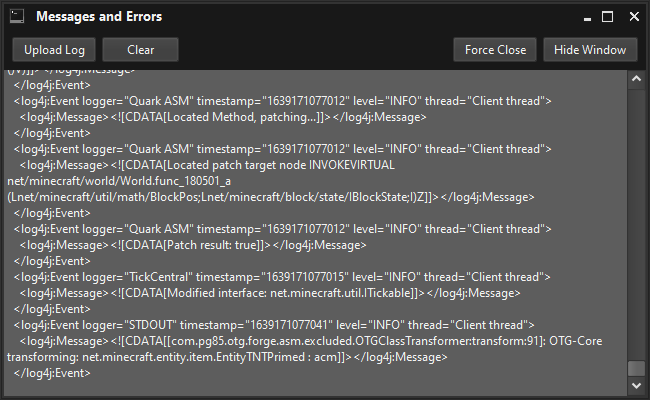

++++++++++++++++++++++
Log4j December Exploit
++++++++++++++++++++++

.. _this: https://www.minecraft.net/en-us/article/important-message--security-vulnerability-java-edition
.. |this| replace:: **this** 

.. note:: The quick link to this page is **mym.li/log4j**

What is Log4j?
==============
Apache's Log4j is a common Java logging library and utility that is used in Java Minecraft amoung other numerous applications.

What Does This Exploit Do?
===========================
In simple terms, it allows anyone who knows how to use the exploit to run a "Remote Code Exection" or "RCE" for short to your computer or server. This allows anyone to perform various amounts of commands to your computer without your consent. A common example is to run a piece of code to make you download malicious malware to steal personal data.

How Can I Protect Myself?
=========================
Mojan/Microsoft came out with |this|_ article to let you know what you can do!

What Has MineYourMind Done To Prevent This?
===========================================
This is split up into two different sections. `The MYM Launcher`_ & `Servers`_ sections. The important thing to note though, is that you should really be playing with patched clients on patched servers. Just relying on patched servers could still leave you vunerable and it is recommend to be playing with both patched clients and patched servers. 

The MYM Launcher
################
Do not be worried! We have you covered! We have patched the MYM launcher to fix this exploit. You want to make sure you have version 4.4.0.3 of the launcher and look in your "Messages and Errors" window for when you start a modpack. The logged messages should start with ``<log4j`` to be sure the modpack you are playing on has the fix. The below image should show you what the "Messages and Errors" window looks like.

|

More information can be found out when this was implemented at this `changelog <https://mineyourmind.net/forum/threads/global-changelog.2705/page-29#post-225524>`_

Servers
#######
All of our current and future servers have been patched to fix this exploit! On our 1.12 and above Minecraft server versions, we try prevent clients from getting sent messages including this RCE but it isn't guaranteed. All of our other server versions do not have a way to really stop this from being sent to clients and can really only stop it from executing an RCE on the server itself. As long as you have a patched client, you will be fine though.  

